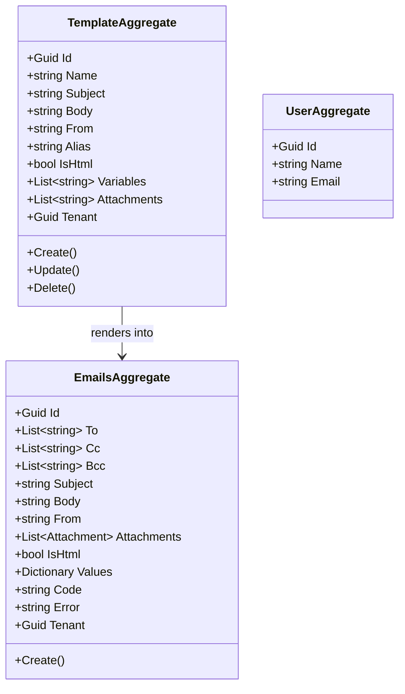
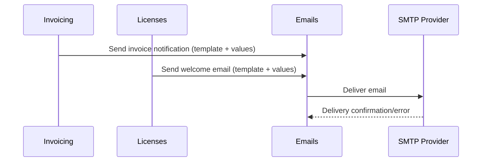

# Emails Microservice

## Overview

The Emails microservice handles all outbound email delivery for the platform. It manages email templates (with variable substitution and HTML support), sends emails on demand (either from templates or with custom bodies), tracks delivery records per tenant, and supports file attachments. Other microservices trigger email sending by publishing events or calling internal APIs, and this service handles the actual SMTP delivery, template rendering, and audit logging.

## Business Context

A SaaS platform sends many types of transactional emails: welcome messages, invoice notifications, password resets, booking confirmations, overdue reminders, and more. Without a centralized email service, each microservice would need to implement its own SMTP integration, template engine, and delivery tracking -- leading to inconsistent branding, duplicated configuration, and difficulty diagnosing delivery issues.

The Emails microservice centralizes all email operations. Templates are defined once with variable placeholders, and sending microservices only need to provide the recipient list and variable values. The service handles rendering, SMTP delivery, attachment handling, and audit logging of every email sent.

For a new developer: this is the "mail room" of the platform. Whenever any part of the system needs to send an email, the request flows through here.

## Ubiquitous Language

| Term        | Definition                                                                                                                     |
| ----------- | ------------------------------------------------------------------------------------------------------------------------------ |
| Email       | A single outbound email message with recipients, subject, body, and optional attachments. Persisted as an audit record.        |
| Template    | A reusable email blueprint with variable placeholders in subject and body. Body is stored as Base64-encoded HTML or plain text.|
| Variable    | A named placeholder within a template (e.g., "{{userName}}", "{{invoiceNumber}}") that is replaced at send time.              |
| To          | The primary recipient list (one or more email addresses).                                                                      |
| Cc          | Carbon copy recipient list.                                                                                                    |
| Bcc         | Blind carbon copy recipient list.                                                                                              |
| From        | The sender email address configured in the template or provided at send time.                                                  |
| Alias       | The display name shown alongside the sender email address (e.g., "Platform Support").                                          |
| Subject     | The email subject line, which may contain variables in templates.                                                               |
| Body        | The email content (HTML or plain text). Stored as Base64 in templates for safe persistence of HTML.                            |
| IsHtml      | Whether the body should be rendered as HTML or plain text.                                                                      |
| Attachment  | A file attached to the email, represented by a name and binary content.                                                        |
| Code        | An optional template code used for matching when sending from a template (alternative to ID lookup).                           |
| Values      | A key-value dictionary provided at send time for variable substitution in templates.                                           |
| Error       | An error message recorded if email delivery failed.                                                                             |
| Tenant      | The tenant context for the email. Platform-level emails may have null tenant.                                                   |
| UserAggregate | A local projection of user data (name, email) used for recipient resolution.                                                 |

## Domain Model

The Emails domain has three aggregates. The `TemplateAggregate` stores reusable email blueprints. The `EmailsAggregate` records each sent email for audit. The `UserAggregate` is a local projection for user email resolution.

## Data Dictionary

### TemplateAggregate

A reusable email template with variable support.

| Field       | Type          | Description                                            |
| ----------- | ------------- | ------------------------------------------------------ |
| Id          | Guid          | Unique identifier of the template                      |
| Name        | string        | Template name for identification                       |
| Subject     | string        | Email subject (may contain variable placeholders)      |
| Body        | string        | Email body in Base64 (HTML or plain text)              |
| From        | string        | Sender email address                                   |
| Alias       | string        | Sender display name                                    |
| IsHtml      | bool          | Whether body is HTML                                   |
| Variables   | List\<string\>| List of variable names expected at send time           |
| Attachments | List\<string\>| List of default attachment file names                  |
| Tenant      | Guid?         | Owning tenant (null for platform-level templates)      |
| CreatedBy   | Guid          | User who created the template                          |
| CreatedAt   | Instant       | UTC timestamp of creation                              |

### EmailsAggregate

An audit record of a sent email.

| Field       | Type                       | Description                                   |
| ----------- | -------------------------- | --------------------------------------------- |
| Id          | Guid                       | Unique identifier of the email record         |
| To          | List\<string\>             | Primary recipients                            |
| Cc          | List\<string\>             | Carbon copy recipients                        |
| Bcc         | List\<string\>             | Blind carbon copy recipients                  |
| Subject     | string                     | Rendered subject line                         |
| Body        | string                     | Rendered body content                         |
| From        | string                     | Sender address                                |
| Attachments | List\<Attachment\>         | Attached files                                |
| IsHtml      | bool                       | Whether body is HTML                          |
| Values      | Dictionary\<string,string\>| Variable values used for rendering            |
| Code        | string?                    | Template code reference                       |
| Error       | string?                    | Error message if delivery failed              |
| Tenant      | Guid?                      | Tenant context                                |
| CreatedAt   | Instant                    | UTC timestamp of sending                      |

## Integration Architecture

Emails receives send requests from other microservices via events or internal API calls and delivers via SMTP.

## Event Catalog

### Events Produced

| Event                        | Trigger                    | Purpose                            |
| ---------------------------- | -------------------------- | ---------------------------------- |
| `EmailSentDomainEvent`       | `EmailsAggregate.Create()` | Audit record of email sent         |
| `TemplateCreatedDomainEvent` | `TemplateAggregate.Create()`| New template registered           |
| `TemplateUpdatedDomainEvent` | `TemplateAggregate.Update()`| Template modified                 |
| `TemplateDeletedDomainEvent` | `TemplateAggregate.Delete()`| Template removed                  |

## API Reference

Base path: `/api`

### Emails

| Method | Path              | Description                                 | Auth    |
| ------ | ----------------- | ------------------------------------------- | ------- |
| GET    | `/api/Email`      | Paginated list of sent emails (audit)       | Bearer  |
| GET    | `/api/Email/{id}` | Get a sent email record by ID               | Bearer  |
| POST   | `/api/Email`      | Send an email (custom or from template)     | Bearer  |

### Templates

| Method | Path                    | Description                      | Auth    |
| ------ | ----------------------- | -------------------------------- | ------- |
| GET    | `/api/Template`         | Paginated list of templates      | Bearer  |
| GET    | `/api/Template/{id}`    | Get a template by ID             | Bearer  |
| POST   | `/api/Template`         | Create a new template            | Bearer  |
| PUT    | `/api/Template/{id}`    | Update a template                | Bearer  |
| DELETE | `/api/Template/{id}`    | Delete a template                | Bearer  |

All endpoints return RFC 7807 Problem Details on error. List responses use `Pagination<T>`.

## Key Design Decisions

- **Body stored as Base64:** Template bodies are Base64-encoded to safely persist HTML content with special characters in MongoDB without escaping issues.

- **Variable validation:** Templates declare their expected variables, and the send operation validates that all required values are provided before attempting delivery.

- **Tenant-scoped templates:** Templates can be global (null tenant) or tenant-specific, allowing organizations to customize email branding while sharing platform-level templates.

- **Audit-first design:** Every email sent creates an `EmailsAggregate` record regardless of success, enabling delivery diagnostics and compliance auditing.

- **Attachments by reference in templates:** Templates store attachment names (not binary content) as defaults. Actual attachment content is provided at send time.

- **No retry logic in domain:** Failed deliveries are recorded with an error message. Retry orchestration is the responsibility of the calling service or a background job.

## Related Microservices

| Microservice | Direction | Integration Point                                             |
| ------------ | --------- | ------------------------------------------------------------- |
| Invoicing    | Inbound   | Triggers email notifications for issued/overdue invoices      |
| Licenses     | Inbound   | Triggers welcome emails after successful purchase             |
| Users        | Reference | User email resolution for recipient lookup                    |
| FileStorage  | Reference | Attachment files may be retrieved from FileStorage            |
