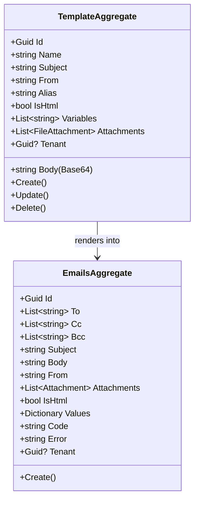

# Emails Microservice

## Overview

The Emails microservice is the centralized communication engine of the platform. It manages email templates, renders HTML with variable substitution, generates PDFs from templates via headless Chromium, sends emails with optional PDF attachments, and maintains a full audit trail of every message sent. Other microservices interact with it exclusively through gRPC, making it the single point of control for all outbound email and document generation.

## Business Context

A SaaS platform sends many types of transactional emails: welcome messages, purchase confirmations, password resets, subscription reminders, invitation notifications, and more. Without a centralized service, each microservice would duplicate SMTP integration, template engines, and delivery tracking -- leading to inconsistent branding, scattered configuration, and difficulty diagnosing delivery issues.

The Emails microservice centralizes all these operations. Templates are defined once with variable placeholders. Calling microservices only provide the template type, recipients, and variable values. This service handles template resolution (with tenant override support), HTML rendering, PDF generation, email delivery via Microsoft Graph, and audit logging.

Additionally, the system supports **tenant override**: each tenant can customize any system template with their own branding. If a tenant-specific template exists, it takes priority; otherwise the system default is used.

## Key Capabilities

- **Template Management**: CRUD for email/PDF templates via REST API with variable placeholders (`{{variable_name}}`)
- **Template Rendering**: Resolves templates by type with tenant-first/system-fallback logic, replaces variables
- **PDF Generation**: Converts rendered HTML templates to PDF using PuppeteerSharp (headless Chromium, A4 format)
- **Email Delivery**: Sends emails via Microsoft Graph API (Office 365) with optional attachments
- **Composed Operations**: Single gRPC call to render email + generate PDF + attach + send (returns PDF bytes to caller)
- **Tenant Override**: Tenants can override system templates with their own branding without affecting other tenants
- **System Seed**: 14 default templates auto-seeded on startup covering authentication, purchases, and notifications
- **Audit Trail**: Every email sent creates an immutable audit record with recipients, content, status, and timestamp

## gRPC Service API

```protobuf
service Emails {
  rpc SendEmail (SendEmailRequest) returns (SendEmailResponse);
  rpc RenderTemplate (RenderTemplateRequest) returns (RenderTemplateResponse);
  rpc GeneratePdf (GeneratePdfRequest) returns (GeneratePdfResponse);
  rpc SendEmailWithPdf (SendEmailWithPdfRequest) returns (SendEmailWithPdfResponse);
}
```

| Method | Use Case |
|--------|----------|
| `SendEmail` | Send a simple email using a template ID |
| `RenderTemplate` | Get rendered HTML from a template type + variables |
| `GeneratePdf` | Generate a PDF from a template type + variables |
| `SendEmailWithPdf` | All-in-one: render email + generate PDF + attach + send. Returns PDF bytes |

## Template Resolution Flow

```
1. Receive templateType (e.g., "PurchaseConfirmation")
2. If tenant context exists:
   a. Search TemplateAggregate where Name == templateType AND Tenant == tenantId
   b. If found → use tenant override
3. If no override found:
   a. Search TemplateAggregate where Name == templateType AND Tenant == null
   b. Use system default template
4. Render with variable substitution
```

## System Templates (14 seeded by default)

### Authentication

| Type | Subject | Variables |
|------|---------|-----------|
| PasswordTemp | Tu contrasena temporal - {{display_name}} | display_name, password, login_app, current_year |
| Welcome | Bienvenido {{display_name}} | display_name, organization_name, login_app, current_year |
| PasswordReset | Restablece tu contrasena | display_name, reset_link, expiration_time, current_year |
| AccountVerification | Verifica tu cuenta | display_name, verification_link, current_year |
| TwoFactorCode | Tu codigo de verificacion | display_name, code, expiration_minutes, current_year |

### Purchases / Licenses

| Type | Subject | Variables |
|------|---------|-----------|
| PurchaseConfirmation | Confirmacion de Compra - {{license_name}} | organization_name, organization_email, organization_phone, organization_document, buyer_name, buyer_email, license_name, billing_type, subtotal, tax, total, currency, purchase_date, current_year |
| PurchaseReceipt | Comprobante de Compra - {{license_name}} | (same as PurchaseConfirmation + order_id, modules_list) |
| PaymentFailed | Error en el pago - {{license_name}} | buyer_name, license_name, error_message, retry_url, current_year |
| SubscriptionExpiring | Tu suscripcion vence pronto | organization_name, license_name, expiration_date, renewal_url, current_year |
| SubscriptionRenewed | Suscripcion renovada - {{license_name}} | organization_name, license_name, next_billing_date, total, currency, current_year |

### Notifications

| Type | Subject | Variables |
|------|---------|-----------|
| InvitationToOrganization | Te han invitado a {{organization_name}} | display_name, organization_name, inviter_name, invitation_link, current_year |
| RoleChanged | Tu rol ha sido actualizado | display_name, organization_name, new_role, current_year |
| AccountDeactivated | Tu cuenta ha sido desactivada | display_name, organization_name, reason, support_email, current_year |
| DataExportReady | Tu exportacion de datos esta lista | display_name, download_url, expiration_date, current_year |

## Domain Model



## Ubiquitous Language

| Term | Definition |
|------|-----------|
| Template | A reusable email/PDF blueprint with variable placeholders. Body stored as Base64-encoded HTML. |
| Variable | A named placeholder (`{{name}}`) replaced at render time with actual values. |
| Tenant Override | A tenant-specific version of a system template that takes priority over the default. |
| System Template | A platform-level template (Tenant == null) seeded automatically on startup. |
| Render | The process of resolving a template, replacing variables, and producing final HTML. |
| PDF Generation | Converting rendered HTML to PDF via headless Chromium (PuppeteerSharp). |
| Audit Record | An EmailsAggregate created for every email sent, tracking recipients, content, and delivery status. |

## API Reference

Base path: `/api`

### Emails

| Method | Path | Description | Auth |
|--------|------|-------------|------|
| GET | `/api/Email` | Paginated list of sent emails (audit) | Bearer |
| GET | `/api/Email/{id}` | Get a sent email record by ID | Bearer |
| POST | `/api/Email` | Send an email (from template with attachments) | Bearer |

### Templates

| Method | Path | Description | Auth |
|--------|------|-------------|------|
| GET | `/api/Template` | Paginated list of templates | Bearer |
| GET | `/api/Template/{id}` | Get a template by ID | Bearer |
| POST | `/api/Template` | Create a new template | Bearer |
| PUT | `/api/Template/{id}` | Update a template | Bearer |
| DELETE | `/api/Template/{id}` | Delete a template | Bearer |

All endpoints return RFC 7807 Problem Details on error. List responses use `Pagination<T>`.

## Event Catalog

### Events Produced

| Event | Trigger | Purpose |
|-------|---------|---------|
| `EmailSentDomainEvent` | `EmailsAggregate.Create()` | Audit record of email sent |
| `TemplateCreatedDomainEvent` | `TemplateAggregate.Create()` | New template registered |
| `TemplateUpdatedDomainEvent` | `TemplateAggregate.Update()` | Template modified |
| `TemplateDeletedDomainEvent` | `TemplateAggregate.Delete()` | Template removed |

### Events Consumed

| Event | Source | Action |
|-------|--------|--------|
| `UserCreatedDomainEvent` | ms-microsoftgraph | Sends temporary password email to new user |
| `TenantCreatedDomainEvent` | ms-tenants | Clones system templates to new tenant |
| `SendEmailDomainEvent` | Any microservice | Sends email from template with optional FileStorage attachments |
| `SendEmailWithPdfDomainEvent` | Any microservice | Generates PDF from template, uploads to FileStorage, sends email with PDF attached |

## Generic Email Events — Integration Standard

Other microservices communicate with ms-emails exclusively through **domain events** (not gRPC) for sending emails. Two generic event contracts are available:

### SendEmailDomainEvent (simple emails)

For sending an email rendered from a template, with optional attachments from FileStorage.

```csharp
[EventKey("EmailAggregate", 1, "SendEmailDomainEvent", "ms-emails")]
public class SendEmailDomainEvent(
    Guid aggregateId,
    string templateName,          // Template name to resolve (e.g., "Welcome")
    List<string> to,
    List<string> cc,
    List<string> bcc,
    Dictionary<string, string> variables,  // Template variable values
    List<FileAttachment> attachments,      // Files already in FileStorage
    Guid tenant
) : DomainEvent(...)
```

### SendEmailWithPdfDomainEvent (emails with generated PDF)

For emails that require generating a PDF from a template before sending. The PDF is generated by ms-emails using PuppeteerSharp and uploaded to FileStorage.

```csharp
[EventKey("EmailAggregate", 1, "SendEmailWithPdfDomainEvent", "ms-emails")]
public class SendEmailWithPdfDomainEvent(
    Guid aggregateId,
    string templateName,          // Template for email body
    string pdfTemplateName,       // Template to render as PDF (can be same)
    List<string> to,
    List<string> cc,
    List<string> bcc,
    Dictionary<string, string> variables,
    List<FileAttachment> attachments,
    Guid tenant
) : DomainEvent(...)
```

### FileAttachment ValueObject

Attachments are references to files in FileStorage, **not binary content**. The consumer downloads them on demand.

```csharp
public sealed partial class FileAttachment
{
    public Guid Id { get; }       // FileStorage aggregate ID
    public string Name { get; }   // Original filename (used for download)
    public string Target { get; } // Storage folder/path
}
```

### How to Publish (any microservice)

1. Define the event class in your AsyncWorker with the **same `[EventKey]`** (appName = `"ms-emails"`)
2. Define the `FileAttachment` ValueObject (same structure)
3. Publish via `IPubSub.PublishAsync()`:

```csharp
var emailEvent = new SendEmailWithPdfDomainEvent(
    aggregateId: orderId,
    templateName: "PurchaseConfirmation",
    pdfTemplateName: "PurchaseReceipt",
    to: [buyerEmail],
    cc: [],
    bcc: [],
    variables: new Dictionary<string, string>
    {
        ["buyer_name"] = "John Doe",
        ["total"] = "$150,000",
        // ... all template variables
    },
    attachments: [],  // Optional: FileStorage references
    tenant: tenantId
);

await pubsub.PublishAsync([emailEvent], cancellationToken);
```

### Processing Flow (ms-emails internal)

```
SendEmailHandler:
  1. Resolve template by name + tenant (tenant-first, system-fallback)
  2. Download attachments from FileStorage (event attachments + template attachments)
  3. Send email via Microsoft Graph with rendered body + attachments

SendEmailWithPdfHandler:
  1. Resolve PDF template by name + tenant
  2. Render HTML with variable substitution
  3. Generate PDF via PuppeteerSharp
  4. Upload PDF to FileStorage (target: emails-pdf/{tenant})
  5. Download all attachments from FileStorage
  6. Add generated PDF to attachment list
  7. Send email via Microsoft Graph
```

## Key Design Decisions

- **Tenant-first resolution**: Templates are resolved by Name + Tenant. Tenant override takes priority over system default, enabling per-organization branding without code changes.

- **Body stored as Base64**: Safely persists HTML content with special characters in MongoDB without escaping issues.

- **Seed with placeholder body**: System templates are seeded with metadata (name, subject, variables) but minimal body content. The real HTML is designed via a web editor/API, allowing each system that uses the SDK to apply its own branding.

- **PuppeteerSharp for PDF**: Headless Chromium renders HTML to PDF with perfect CSS fidelity (flexbox, modern layout, custom fonts). Runs in the gRPC entrypoint container with Chromium installed.

- **Audit-first design**: Every email creates an immutable `EmailsAggregate` record regardless of delivery success, enabling diagnostics and compliance.

- **Event-driven as primary inter-service interface**: Other microservices publish `SendEmailDomainEvent` or `SendEmailWithPdfDomainEvent` via RabbitMQ. The REST API is for admin/template management. gRPC is available for synchronous use cases (template rendering, PDF generation) but email sending should prefer events.

- **FileAttachment as value object**: Template attachments are stored as references to FileStorage (`{ Id, Name, Target }`), not binary content. This keeps the database lightweight and leverages the existing File Storage infrastructure for binary management.

## Related Microservices

| Microservice | Direction | Integration Point |
|--------------|-----------|-------------------|
| Licenses | Inbound (Event) | Emits `SendEmailWithPdfDomainEvent` for purchase receipt email with PDF |
| MicrosoftGraph | Inbound (Event) | Triggers password temp email on user creation |
| Tenants | Inbound (Event) | Triggers template provisioning on tenant creation |
| FileStorage | Outbound (SDK) | Downloads attachments and uploads generated PDFs |
| Notification | Peer | Caller sends SignalR notification alongside email |
| Any microservice | Inbound (Event) | Any service can emit `SendEmailDomainEvent` / `SendEmailWithPdfDomainEvent` |

## Infrastructure Requirements

- **MongoDB**: Template and email audit storage (`db-ms-emails`)
- **RabbitMQ**: Event consumption (UserCreatedDomainEvent)
- **Microsoft Graph API**: Email delivery (requires Azure AD credentials)
- **Chromium**: Required in gRPC container for PDF generation (`PUPPETEER_EXECUTABLE_PATH`)
- **Vault**: Credentials management (Azure AD secrets, transit encryption)
- **Redis**: Template caching
